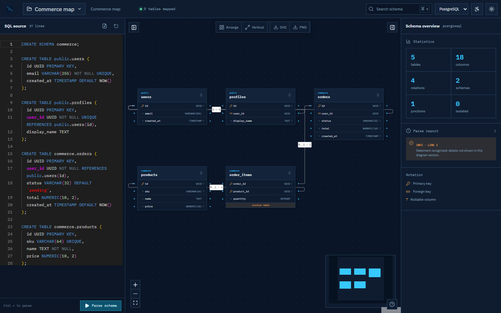
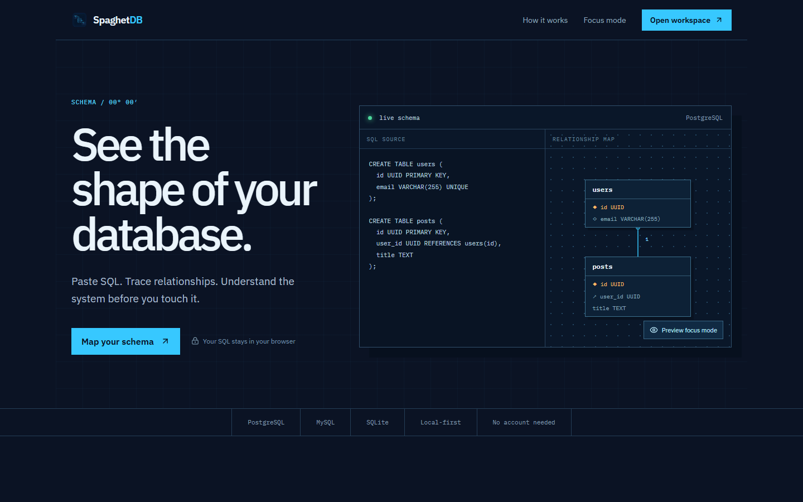

<div align="center">
  
  <h1>SpaghetDB</h1>
  <p><strong>Turn SQL DDL into an interactive database map.</strong></p>
  <p>Private by default. No account. No database connection. No schema upload.</p>
</div>



SpaghetDB is a browser-based schema visualizer for developers who need to understand a database before changing it. Paste or import PostgreSQL, MySQL, or SQLite DDL, then inspect tables, follow foreign keys, isolate a relationship neighborhood, and export the result.

## What it does

- Parses `CREATE TABLE` and `CREATE INDEX` statements in a Web Worker.
- Maps columns, primary keys, foreign keys, unique constraints, defaults, and nullability.
- Infers 1:1 and 1:N cardinality and identifies common junction-table patterns.
- Provides a draggable, zoomable canvas with column-level relationship anchors.
- Finds tables and columns from the keyboard with <kbd>Ctrl</kbd>/<kbd>⌘</kbd> + <kbd>K</kbd>.
- Isolates a table and its direct neighbors with Focus Mode.
- Runs automatic graph layout off the UI thread.
- Saves projects and canvas positions in IndexedDB.
- Exports projects as JSON and diagrams as SVG or 2× PNG.
- Includes dark, light, high-contrast, large-text, reduced-motion, and keyboard-accessible modes.

All parsing and storage happen locally in the browser.

## Try it

```bash
git clone https://github.com/flennium/SpaghetDB.git
cd SpaghetDB
npm install
npm run dev
```

Open `http://localhost:5173`. Node.js 20.19 or newer is required.

## How to use it

1. Open the workspace and select the SQL dialect.
2. Paste SQL or import a `.sql` file.
   You can also choose a realistic or stress-test schema from the **Examples** menu above the editor.
3. Press <kbd>Ctrl</kbd>/<kbd>⌘</kbd> + <kbd>Enter</kbd> to parse.
4. Click a table to inspect it. Double-click it—or focus it and press <kbd>F</kbd>—to enter Focus Mode.
5. Arrange the graph manually or use horizontal/vertical auto-layout.
6. Export the canvas or save the complete project file.

Press <kbd>?</kbd> in the workspace for the full shortcut guide.

## Supported SQL

The current release targets schema visualization rather than full SQL execution.

| Capability | PostgreSQL | MySQL | SQLite |
| --- | :---: | :---: | :---: |
| `CREATE TABLE` | ✓ | ✓ | ✓ |
| Inline/table primary keys | ✓ | ✓ | ✓ |
| Foreign and unique constraints | ✓ | ✓ | ✓ |
| Composite keys | ✓ | ✓ | ✓ |
| `CREATE [UNIQUE] INDEX` | ✓ | ✓ | ✓ |
| Defaults and nullability | ✓ | ✓ | ✓ |
| Vendor-specific clauses | Best effort | Best effort | Best effort |

Unsupported schema statements appear as diagnostics instead of stopping the rest of the file. Valid statements still produce a diagram when another statement fails.

## Example and stress schemas

The editor includes three realistic starting points: a PostgreSQL commerce platform, a MySQL deployment service, and a SQLite publishing notebook. It also loads these deterministic PostgreSQL stress fixtures directly from the browser:

| Fixture | Tables | Purpose |
| --- | ---: | --- |
| [`stress-100.sql`](public/examples/stress-100.sql) | 100 | Routine interaction and layout testing |
| [`stress-500.sql`](public/examples/stress-500.sql) | 500 | Sustained parser, renderer, search, and layout load |
| [`stress-1000.sql`](public/examples/stress-1000.sql) | 1,000 | Extreme-load and regression testing |

Each fixture contains branching foreign keys, secondary ownership relationships, unique constraints, JSON payloads, defaults, and indexes. Regenerate all three after changing the fixture design with `npm run generate:stress`; output is deterministic and committed for direct download.

## Architecture

```text
SQL source
  └─ parser worker
       └─ dialect adapter / node-sql-parser
            └─ normalized SchemaModel
                 ├─ React Flow renderer
                 ├─ ELK layout worker
                 ├─ search + inspector
                 └─ IndexedDB persistence
```

The UI never consumes parser-specific AST nodes. Everything downstream uses the normalized, versioned model in [`src/domain/types.ts`](src/domain/types.ts), keeping rendering and persistence independent from parser internals.

Large schemas receive two additional safeguards: parsing and layout run in dedicated workers, and the canvas mounts only nodes currently inside the viewport. The automated suite parses both a 500-table chain and the shipped 1,000-table branching fixture.

More detail is available in [the architecture notes](docs/ARCHITECTURE.md).

## Development

```bash
npm run dev        # local development server
npm test           # parser and normalization tests
npm run lint       # Oxlint
npm run build      # type-check and production bundle
npm run check      # all release checks
npm run generate:stress # regenerate large SQL fixtures
```

Pull requests are welcome. Read [CONTRIBUTING.md](CONTRIBUTING.md) before making a larger change.

## Privacy

SpaghetDB has no backend, analytics SDK, or database connector. SQL, parsed schema data, and layout state remain in the browser's IndexedDB unless the user explicitly downloads an export.

## Screenshots

### Landing page



### Workspace


